 

<!--
  GitHub stats (optional). Replace YOUR_GITHUB_USERNAME with your real GitHub username,
  then delete this comment markers so the section shows up.

-->

## About me

Junior Fullstack Developer and Graphic Designer. B.Tech Information Technology student at INFO Institute of Engineering (2023–2027), building web apps with Node.js, React.js and Next.js, and exploring AI and automation.

## Projects

- **Skill Circuit**: interactive coding-language learning platform (Java, Python, HTML)
- **Grammar & Syntax Automation Tool**: text-processing utility that finds and corrects grammar errors
- **InfiniT Website**: official IT department website with multiple interactive pages and UI/UX design
